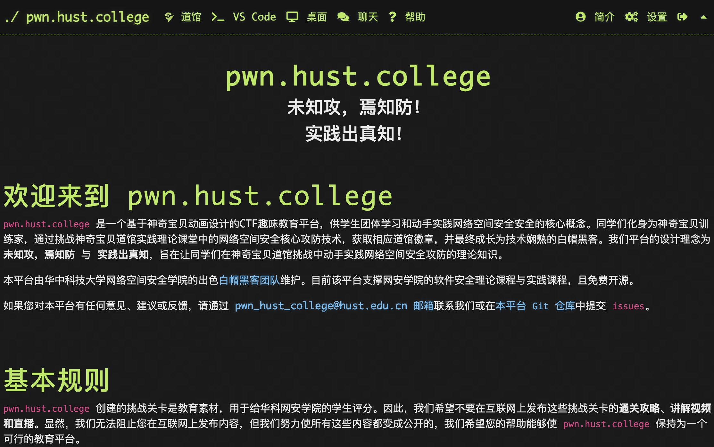

# DOJO

**Deploy your pwn.hust.college dojo instance** – a customized fork of the original [pwn.college platform](https://github.com/pwncollege/dojo) – to create tailored cybersecurity training environments.

## Introduction

Same with pwn.college, our pwn.hust.college dojo infrastructure is based on [CTFd](https://github.com/CTFd/CTFd). CTFd provides features like user authentication, challenge management, and flag validation, this repository extends its capabilities to create a structured, scalable environment for cybersecurity training. Furthermore, the pwn.hust.college also provides some features related to HUST(Huazhong University of Science and Technology), e.g., HUST SSO login, DeepSeek TA, KOOK integration and cybersecurity courses.

- [📜 History](./docs/history.md)
- [🏛️ Architecture](./docs/architecture.md)
- [🚀 Deployment](./docs/general_deployment.md)
- [🏆 pwn.hust.college Deployment](./docs/pwnhustcollege_deployment.md)
- [🚩 Challenge](./docs/challenge.md)
- [💻 Development](./docs/development.md)

Have more questions? Open an ❓[issue](https://github.com/hust-open-atom-club/dojo/issues) or reach out to us on our 💬 [KOOK](https://kook.top/soUkFL).

## Contributing

We love Pull Requests! 🌟
Have a small update?
Send a PR so everyone can benefit.

Together, we make this project better for all! 🚀 
Please refer to [CONTRIBUTING.md](/CONTRIBUTING.md) for more details.
